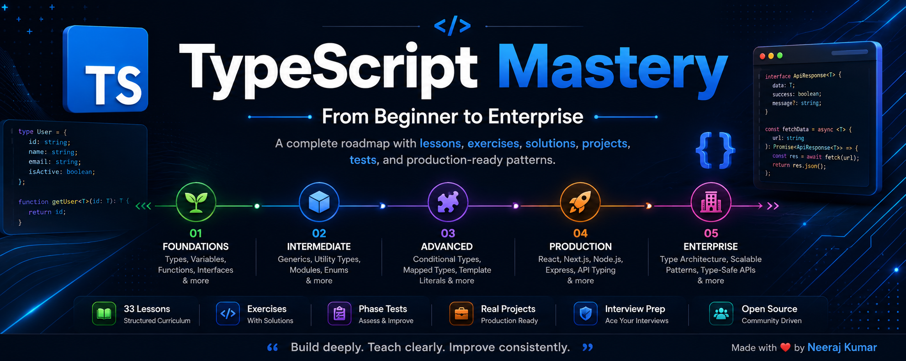
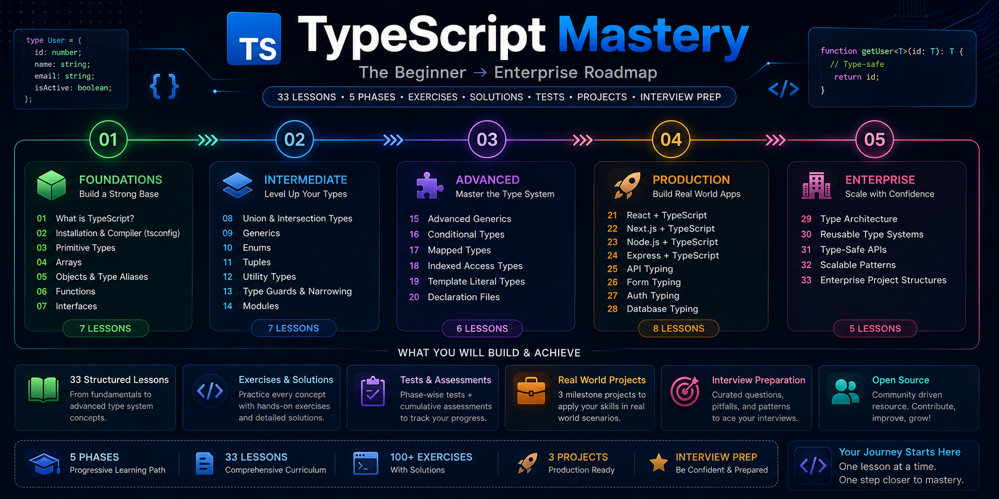

🚀 TypeScript Mastery

The Beginner → Enterprise TypeScript Roadmap

A carefully crafted open-source handbook designed to take you from absolute beginner to production-ready TypeScript developer through structured lessons, exercises, solutions, assessments, and real-world projects.

  
  
  

  
  
  
  
  

⭐ If this repository helps you, please consider starring it!

---

🗺️ Learning Roadmap

  

---

✨ Why TypeScript Mastery?

Most TypeScript resources either:

- Cover only the basics.
- Jump into advanced concepts too quickly.
- Lack exercises and practical projects.
- Focus on syntax rather than understanding.

TypeScript Mastery is being built as the handbook I wish I had when I started learning TypeScript.

What you'll find here

- 📚 A structured beginner-to-enterprise curriculum.
- 🧠 Exercises with worked solutions.
- 🧪 Phase-wise assessments.
- 🏗️ Real-world milestone projects.
- ⚛️ React + TypeScript patterns.
- ▲ Next.js + TypeScript patterns.
- 🖥️ Node.js & Express + TypeScript.
- 🏢 Enterprise-scale type architecture.
- 💼 Interview preparation resources.
- 🎨 Visual explanations and diagrams.

Whether you're a complete beginner, a JavaScript developer transitioning to TypeScript, or someone preparing for interviews, this repository is designed to help you learn deeply and build confidently.

---

📈 Current Progress

Metric| Status
📚 Lessons Completed| 9 / 33
🗂️ Phases Planned| 5
🧠 Exercises| ✅ Included
📝 Solutions| ✅ Included
🧪 Assessments| 🚧 Planned
🏗️ Projects| 🚧 Planned
💼 Interview Prep| 🚧 In Progress

➡️ Detailed progress: "PROGRESS.md" (./PROGRESS.md)

---

🧭 Curriculum Overview

<b>🟢 Phase 1 — Foundations</b>
Goal

Build a strong understanding of TypeScript fundamentals.

Topics

- What is TypeScript?
- Installation & Compiler Configuration
- Primitive Types
- Arrays
- Objects & Type Aliases
- Functions
- Interfaces

<b>🔵 Phase 2 — Intermediate</b>
Goal

Learn expressive and reusable types.

Topics

- Union & Intersection Types
- Generics
- Enums
- Tuples
- Utility Types
- Type Guards & Narrowing
- Modules

<b>🟣 Phase 3 — Advanced</b>
Goal

Master the TypeScript type system.

Topics

- Advanced Generics
- Conditional Types
- Mapped Types
- Indexed Access Types
- Template Literal Types
- Declaration Files

<b>🟠 Phase 4 — Production TypeScript</b>
Goal

Apply TypeScript in real applications.

Topics

- React + TypeScript
- Next.js + TypeScript
- Node.js + TypeScript
- Express + TypeScript
- API Typing
- Form Typing
- Auth Typing
- Database Typing

<b>🔴 Phase 5 — Enterprise TypeScript</b>
Goal

Design scalable type systems and architectures.

Topics

- Type Architecture
- Reusable Type Systems
- Type-Safe APIs
- Scalable Patterns
- Enterprise Project Structures

➡️ Full roadmap: "ROADMAP.md" (./ROADMAP.md)

---

🧭 Recommended Learning Path

🆕 New to TypeScript?

Start with Phase 1 and complete every exercise before moving ahead.

🟨 JavaScript Developer?

Focus on:

- Foundations
- Generics
- Utility Types
- Modules
- Production TypeScript

💼 Interview Preparation?

Complete all phases and practice the assessment exercises.

🚀 Building Production Apps?

Finish through Phase 4 and build the milestone projects.

---

🏗️ Milestone Projects

1️⃣ Typed Todo API

Build a REST API with proper request and response typing.

2️⃣ Typed Express Application

Learn scalable backend patterns, validation, middleware typing, and error handling.

3️⃣ Full-Stack Typed Application

Combine frontend and backend TypeScript into a production-style application.

---

📂 Repository Structure

typescript-mastery/
├── phase-1-foundations/
├── phase-2-intermediate/
├── phase-3-advanced/
├── phase-4-production-typescript/
├── phase-5-enterprise-typescript/
├── projects/
├── resources/
├── ROADMAP.md
├── PROGRESS.md
└── README.md

---

🌟 What Makes This Repository Different?

Unlike most TypeScript tutorials, this repository focuses on:

- 🎯 A complete learning roadmap.
- 🧪 Exercises with worked solutions.
- 🏗️ Project-based learning.
- ⚛️ Frontend + Backend TypeScript.
- 🏢 Enterprise-scale patterns.
- 📚 Interview preparation.
- 🎨 Visual explanations and diagrams.
- 🌱 Open-source collaboration.
- 🔄 Continuously improved curriculum.

This project is being built as a long-term educational resource rather than a collection of isolated notes.

---

💼 Interview Preparation

Planned interview resources include:

- Beginner questions.
- Intermediate questions.
- Advanced questions.
- Common TypeScript pitfalls.
- Frequently asked interview patterns.

---

🤝 Contributing

Contributions are welcome!

You can help by:

- Fixing typos.
- Improving explanations.
- Adding exercises.
- Adding diagrams.
- Reporting issues.
- Suggesting better examples.

Please read CONTRIBUTING.md before opening a Pull Request.

---

🛣️ Project Roadmap

- [x] Repository structure.
- [x] First 9 lessons.
- [ ] Complete Foundations.
- [ ] Complete Intermediate.
- [ ] Complete Advanced.
- [ ] Add all phase assessments.
- [ ] Add cumulative assessments.
- [ ] Complete milestone projects.
- [ ] Add visual diagrams.
- [ ] Launch documentation website.

---

⭐ Support the Project

If this repository helps you:

- ⭐ Star the repository.
- 🍴 Fork it.
- 🐛 Report issues.
- 💡 Suggest improvements.
- 🔗 Share it with other developers.

Every star motivates further development.

---

👨‍💻 About the Author

Neeraj Kumar

- Full Stack MERN Developer
- Builder of developer tools and educational resources
- Currently focused on TypeScript, System Design, and AI Engineering

Connect with me

- 🌐 GitHub: https://github.com/Neeraj05042001
- 💼 LinkedIn: https://www.linkedin.com/in/neeraj-kumar1904/

---

📘 Build deeply. Teach clearly. Improve consistently.

Made with ❤️ by developers, for developers.

<!-- # TypeScript Mastery — From Zero to Production

A structured, hands-on TypeScript learning repo covering everything 
from fundamentals to enterprise-grade type systems.

Built in public as I learn — documented like a professional handbook.

## Who This Is For
- Developers learning TypeScript from scratch
- JavaScript developers making the switch
- Anyone preparing for TypeScript interviews

## Curriculum

| Phase | Topics | Status |
|-------|--------|--------|
| Phase 1 — Foundations | Primitives, Arrays, Objects, Functions, Interfaces | ✅ In Progress |
| Phase 2 — Intermediate | Generics, Unions, Utility Types, Type Guards | 🔜 Coming Soon |
| Phase 3 — Advanced | Conditional Types, Mapped Types, Declaration Files | 🔜 Coming Soon |
| Phase 4 — Production | React, Next.js, Node.js, Express | 🔜 Coming Soon |
| Phase 5 — Enterprise | Type Architecture, Scalable Patterns | 🔜 Coming Soon |

## How Each Lesson Is Structured
Every lesson folder contains:
- `notes.md` — Full concept handbook
- `qa-reference.md` — Interview Q&A reference
- `exercises/exercises.ts` — Practice problems
- `exercises/solutions.ts` — Worked solutions

## Progress
See [PROGRESS.md](./PROGRESS.md) for a live update of completed lessons. -->