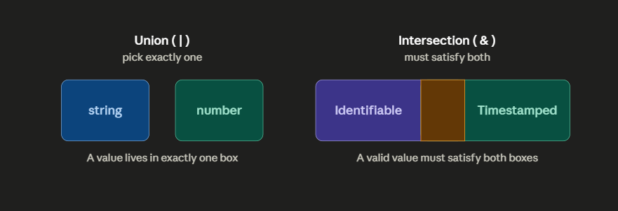

# Phase 2 — Intermediate

> **7 lessons · In progress**

This phase teaches the tools that make TypeScript expressive in real applications: modeling multiple states, preserving type information, transforming existing types, and safely narrowing uncertain values.

  

## You will be able to

- Model alternative and combined data shapes with unions and intersections.
- Write reusable, type-preserving code with generics.
- Use built-in utility types rather than duplicating contracts.
- Narrow unknown values safely before using them.
- Organize types and code across modules.

## Current availability

| Status | Material |
| --- | --- |
| Available | [Lesson 08 — Union and Intersection Types](./lesson-08-unions-&-intersections/) |
| Published draft | [Literal Types and Type Narrowing](./lesson-09-literal-types-&-type-narrowing/) |

## Planned sequence

| # | Lesson |
| ---: | --- |
| 08 | Union and Intersection Types |
| 09 | Generics |
| 10 | Enums |
| 11 | Tuples |
| 12 | Utility Types |
| 13 | Type Guards and Narrowing |
| 14 | Modules |

> [!IMPORTANT]
> The published Literal Types and Type Narrowing draft needs to be repositioned to match the final sequence above before Phase 2 is marked complete. See [PROGRESS.md](../PROGRESS.md) for the maintenance note.

## Completion checkpoint

You will finish this phase by modeling a small feature with unions, generics, utility types, and runtime narrowing—without losing type safety at module boundaries.

---

Review the [full roadmap](../ROADMAP.md) or continue from [Phase 1](../phase-1-foundations/).
